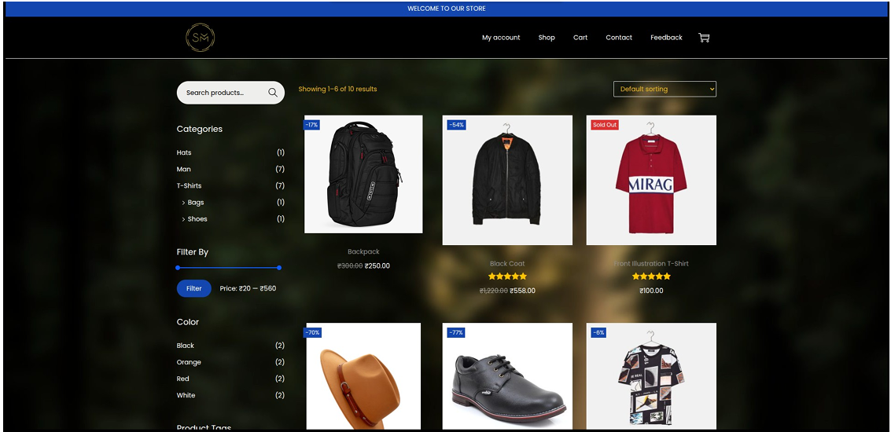
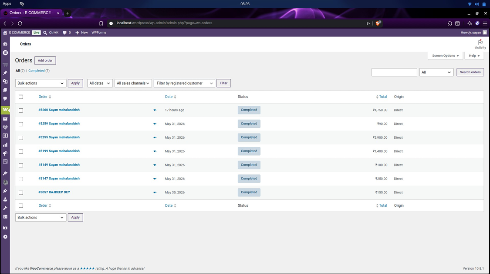
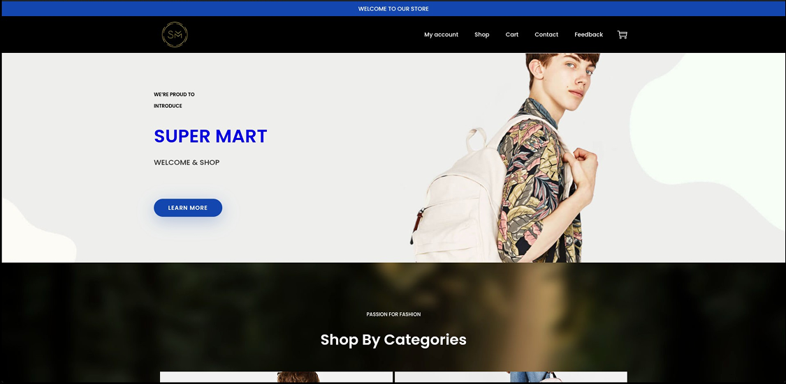
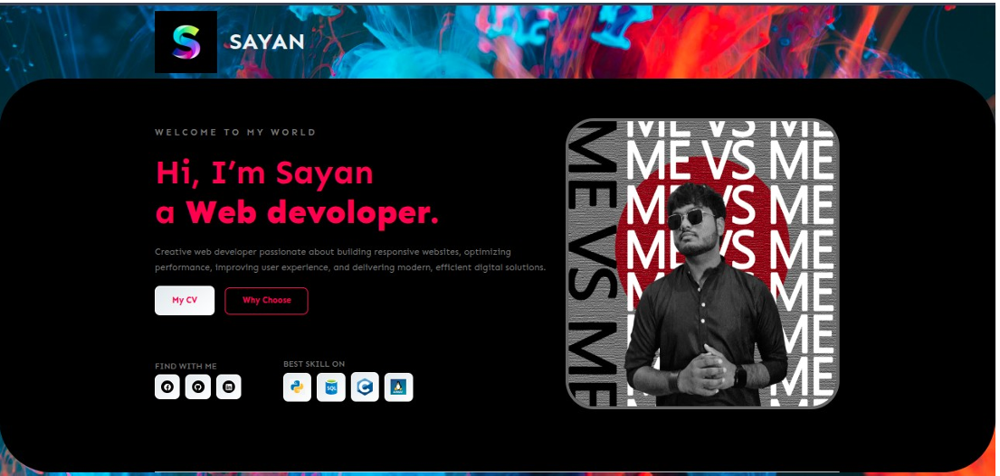
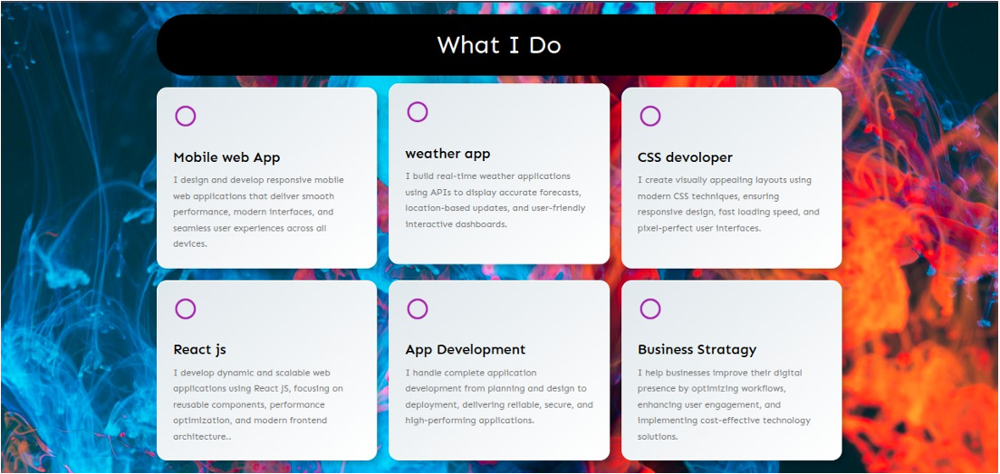

# 🛒 Super Mart — WordPress E-Commerce Website

A modern e-commerce website built using **WordPress**, **WooCommerce**, **Woostify Theme**, **Elementor**, and custom CSS.

## 📌 Project Overview

**Super Mart** is a locally hosted online shopping website designed for fashion products such as clothing, shoes, hats, bags, and accessories.

The project includes product catalogue, cart, checkout, account system, contact page, feedback form, and payment gateway setup.

## 🚀 Features

- 🏠 Modern Home Page
- 🛍️ Product Shop Page
- 🔎 Product Search and Filters
- 🧾 Product Categories
- 🛒 Cart System
- 💳 Checkout Page
- 👤 My Account Page
- ❤️ Wishlist Feature
- 🎨 Variable Product Swatches
- 📝 Feedback Form
- 📍 Contact Page with Google Map
- 📱 Responsive Design
- 🌙 Dark Theme UI
- 🎯 Custom CSS Styling

## 🛠️ Technologies Used

| Technology | Purpose |
|---|---|
| WordPress | CMS platform |
| WooCommerce | E-commerce functionality |
| Woostify | WordPress theme |
| Elementor | Page builder |
| MySQL | Database |
| PHP | Backend environment |
| Custom CSS | UI customization |
| LocalWP / XAMPP | Local server |

## 🔌 Plugins Used

| Plugin | Purpose |
|---|---|
| WooCommerce | Product, cart, checkout, order management |
| Elementor | Drag-and-drop page design |
| WooCommerce Stripe Gateway | Card payment integration |
| TI WooCommerce Wishlist | Wishlist feature |
| Variation Swatches for WooCommerce | Size/color swatches |
| WPForms Lite | Feedback form |
| Smash Balloon Instagram Feed | Social media integration |
| Woostify Sites Library | Demo layout reference |
| Akismet Anti-spam | Spam protection |

## 📄 Website Pages

- Home
- Shop
- Product Details
- Cart
- Checkout
- My Account
- Contact
- Feedback

## 🧪 Testing

The project was tested for:

- Product browsing
- Add to cart
- Cart update/remove
- Checkout process
- User login/register
- Feedback form submission
- Responsive layout on desktop, tablet, and mobile

## ⚠️ Limitations

- Hosted locally only
- Stripe runs in test mode
- Instagram Feed plugin not connected to live account
- Real payment is not enabled

## 📸 Project Screenshots

### 🛒 E-Commerce Website

### 🛒 Portfolio Website

